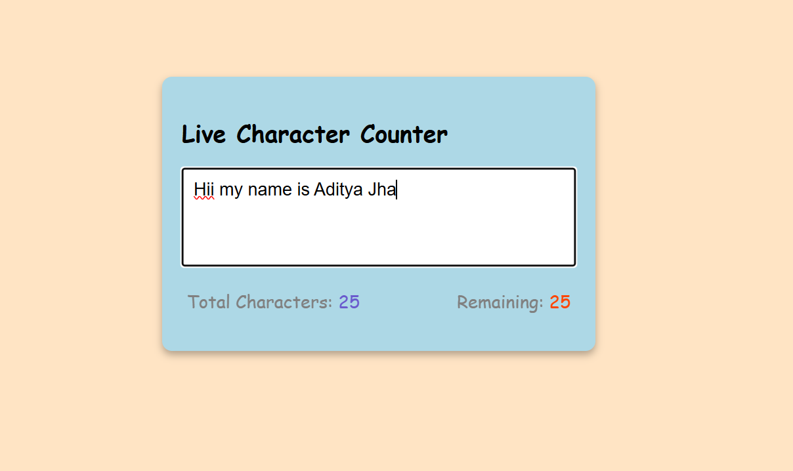

# Character Counter

A simple mini web project that counts the number of characters typed into a textarea and shows how many characters are left.

## Preview

## Features

- Live character counting as you type
- Remaining character count based on the textarea limit
- Clean, minimal interface
- Built with plain HTML, CSS, and JavaScript

## How It Works

- The textarea is limited to 50 characters using `maxlength`.
- JavaScript listens for keyboard input.
- On each update, the app:
  - counts the total characters entered
  - calculates the remaining characters
  - updates both values on the page

## Tech Stack

- HTML
- CSS
- JavaScript

## Project Structure

- `index.html` - main page structure
- `style.css` - page styling
- `script.js` - character counter logic

## Run the Project

1. Open the project folder.
2. Open `index.html` in your browser.
3. Start typing in the textarea.

## Notes

- The textarea has a maximum length of 50 characters.
- The counter updates in real time while typing.
