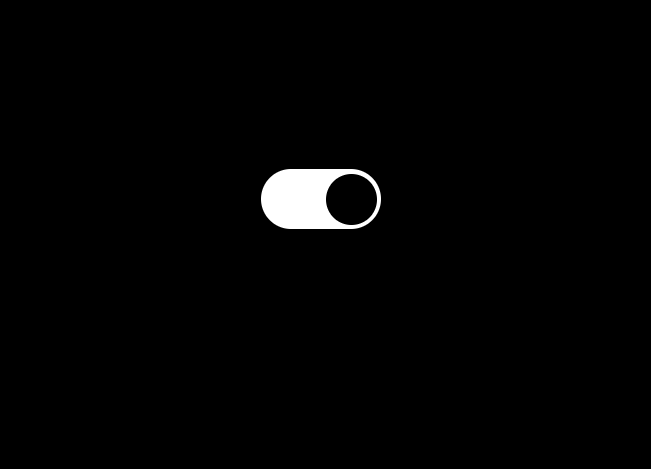

# Dark Mode Toggle

A small UI project that switches the page between light and dark mode.

## Preview

## Features

- Toggle between light and dark themes
- Saves the selected mode in `localStorage`
- Restores the mode on reload
- Minimal and clean design

## Tech Stack

- HTML
- CSS
- JavaScript

## How It Works

- A checkbox controls the theme switch.
- JavaScript updates the page background based on the checkbox state.
- The selected mode is stored in the browser so it stays after refresh.

## Run the Project

1. Open the `Dark-Mode-Toggle` folder.
2. Open `index.html` in your browser.
3. Click the toggle to switch themes.
