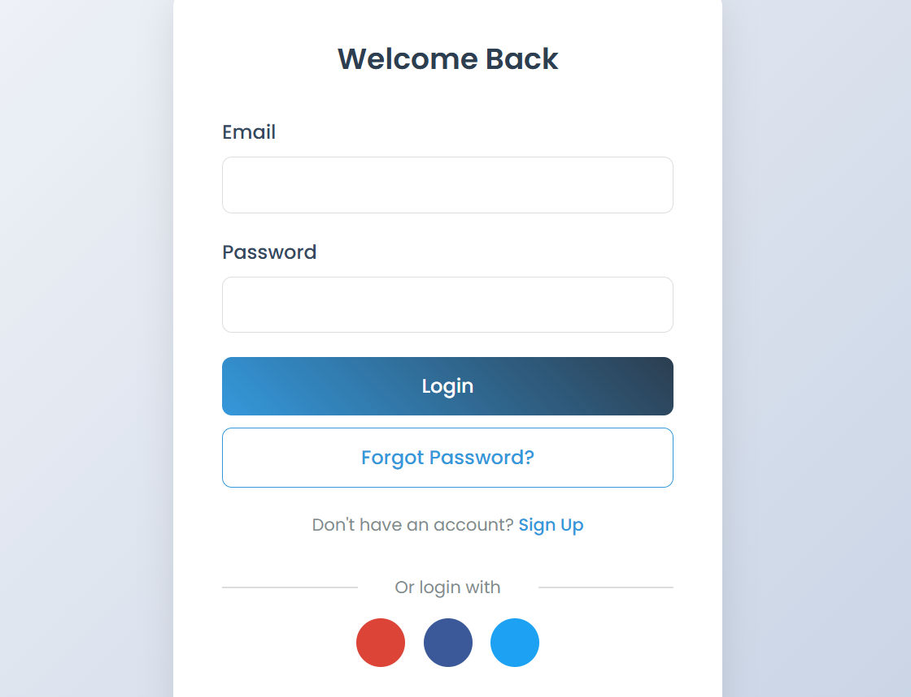

# Login SignUp Form 1

A modern authentication interface built with HTML, CSS, and JavaScript.

## Preview

## Features

- Toggle between Login, Sign Up, and Password Reset forms
- Form validation for inputs
- Social media login buttons
- Responsive design for mobile screens

## Tech Stack

- HTML
- CSS
- JavaScript

## How It Works

- JavaScript handles form toggling by changing element display properties.
- Event listeners capture form submissions and display success or error messages.
