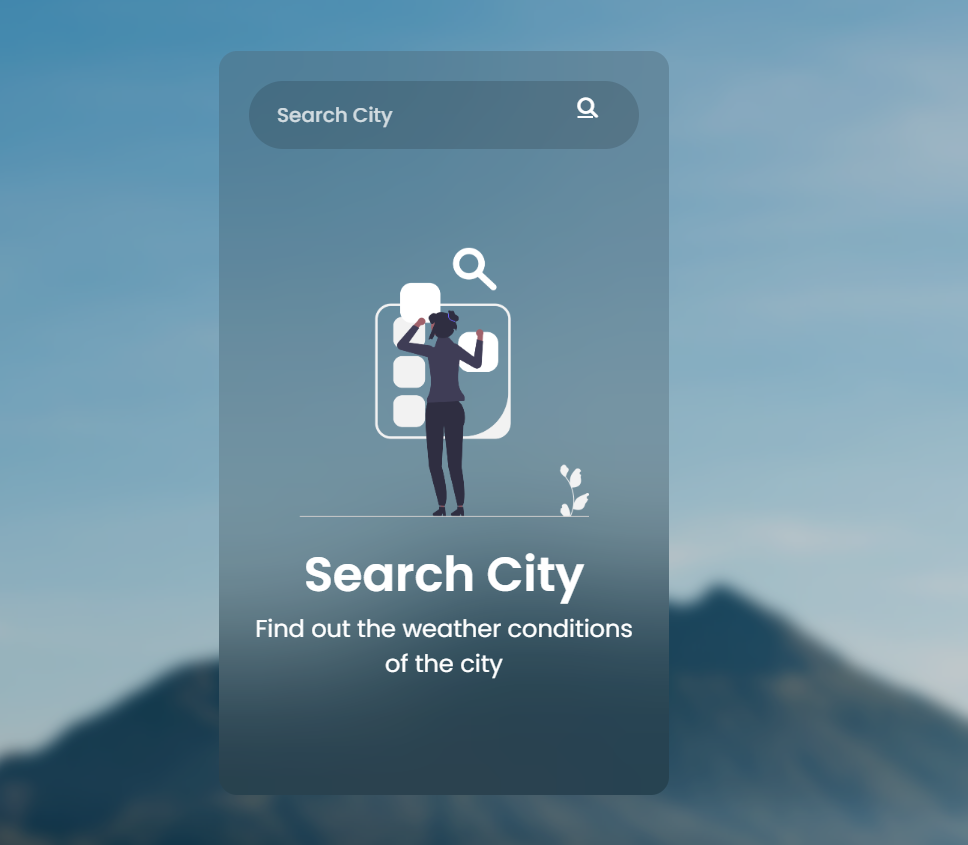
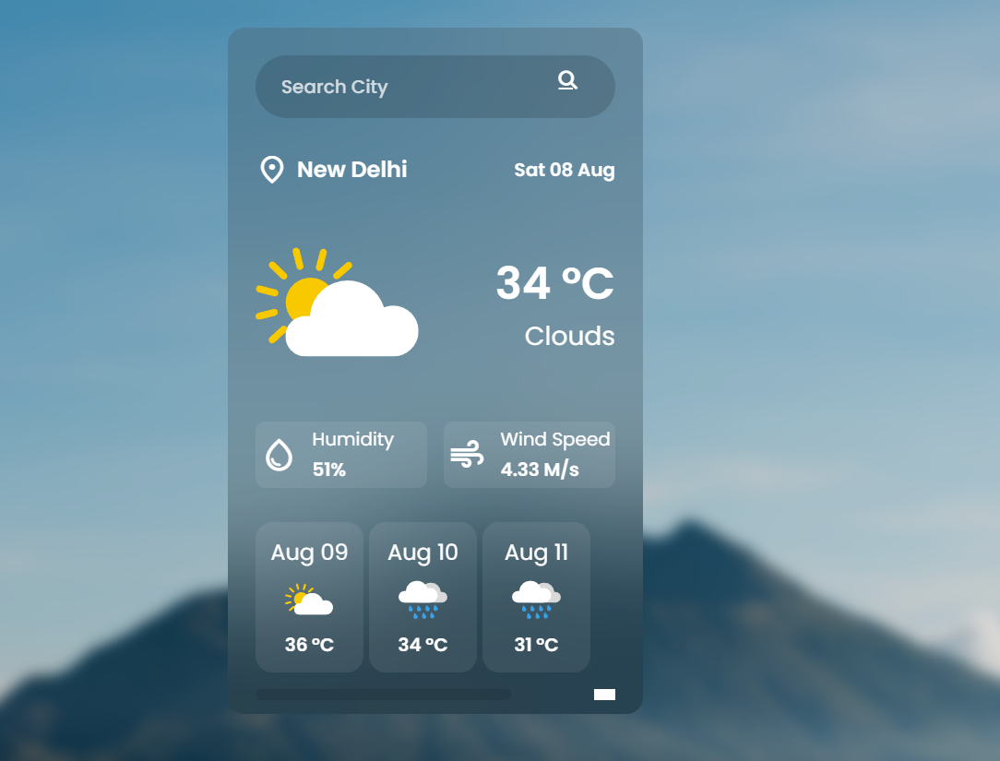
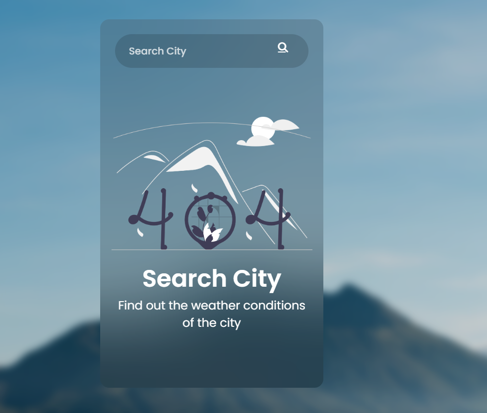

# Weather App

A weather forecast app built with HTML, CSS, and JavaScript using the OpenWeather API.

## Preview

## Features

- Search weather by city name
- Shows current temperature, humidity, wind speed, and condition
- Displays a not-found message for invalid cities
- Shows forecast cards
- Weather icons change based on conditions

## Tech Stack

- HTML
- CSS
- JavaScript
- OpenWeather API

## How It Works

- The app sends a request to the OpenWeather API when a city is entered.
- The response is used to update the current weather UI.
- If the city is invalid, the not-found section is shown.
- Forecast data is also rendered below the main weather card.

## Run the Project

1. Open the `Weather-App` folder.
2. Open `index.html` in your browser.
3. Enter a city name and search.

## Notes

- A valid OpenWeather API key is required.
- The app depends on internet access to fetch live weather data.
