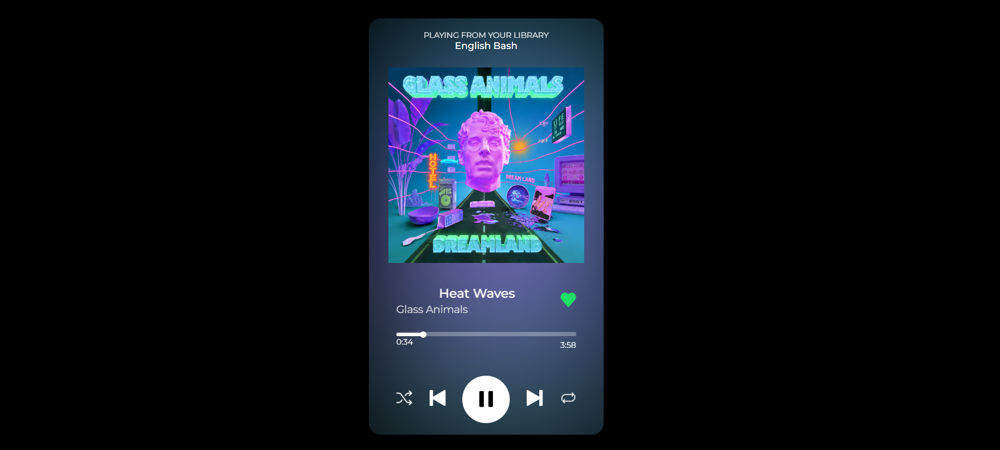

# Music Card

A Spotify-inspired music player card UI built with HTML and CSS.

## Preview

## Features

- Album-style card layout
- Song title and artist display
- Play, next, previous, and shuffle controls
- Clean dark visual style

## Tech Stack

- HTML
- CSS

## How It Works

- The interface is built as a static music card.
- Icons and artwork are used to recreate a music player look.
- It is a UI demo without real audio playback logic.

## Run the Project

1. Open the `Music-Card` folder.
2. Open `index.html` in your browser.
3. View the music card layout.
