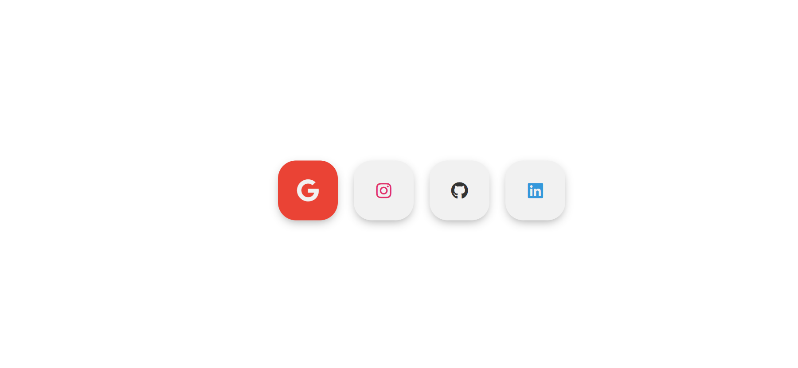
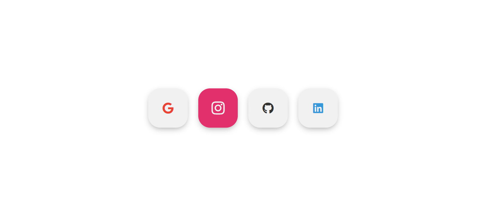
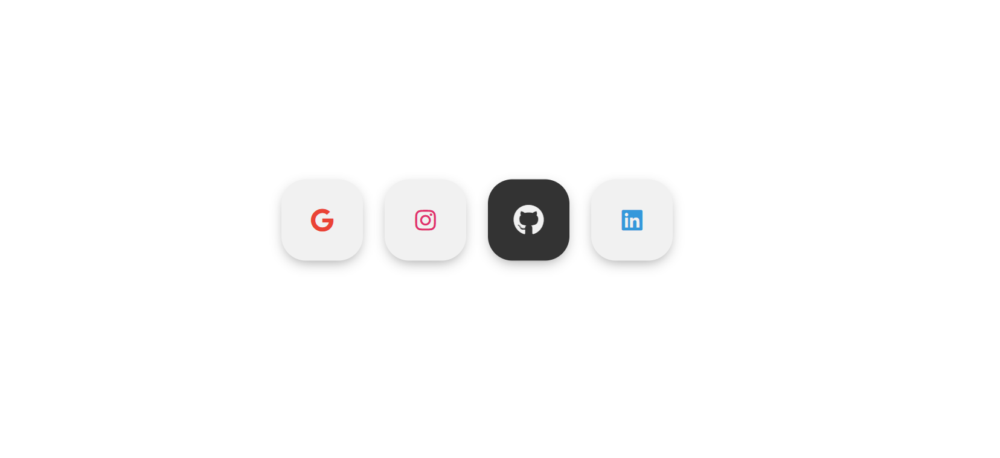
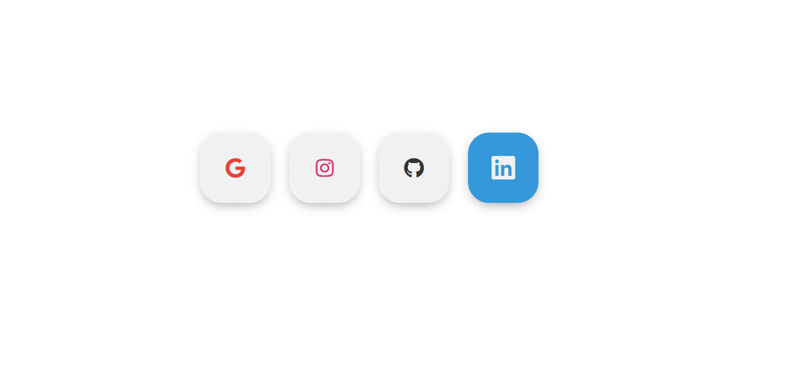

# Social Icons

A small social media icon layout with hover-friendly styling.

## Preview

## Features

- Google, Instagram, GitHub, and LinkedIn icons
- Clean centered icon row
- Simple hover-ready button design

## Tech Stack

- HTML
- CSS
- Font Awesome

## How It Works

- Each social platform is represented by an icon button.
- Styling controls spacing, alignment, and visual effects.

## Run the Project

1. Open the `social-icons` folder.
2. Open `index.html` in your browser.
3. View the social icon buttons.
