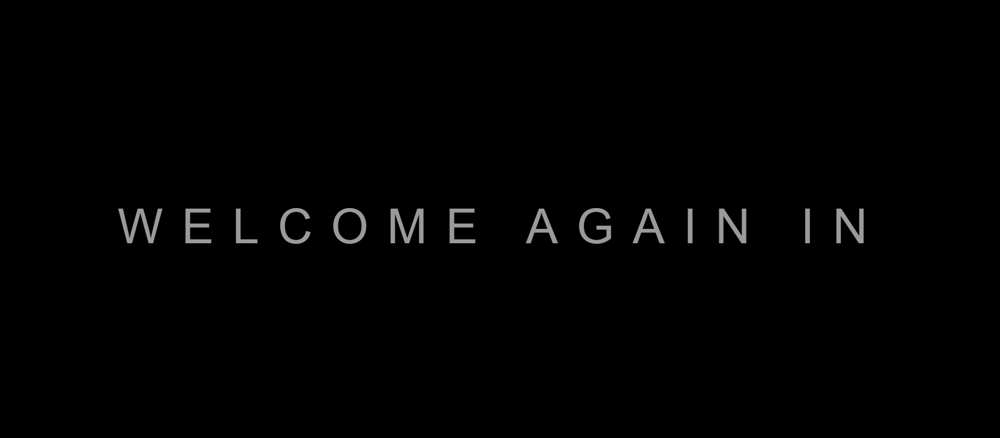

# Text Animation

A simple animated text effect built with HTML and CSS.

## Preview

## Features

- Animated welcome text
- Two text lines with a clean visual effect
- Lightweight frontend-only demo

## Tech Stack

- HTML
- CSS

## How It Works

- The animation is handled entirely through CSS.
- The page displays styled text with motion effects for a polished intro look.

## Run the Project

1. Open the `text-animation` folder.
2. Open `index.html` in your browser.
3. Watch the text animation play.
